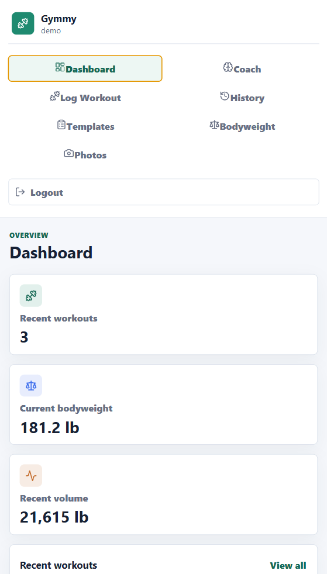
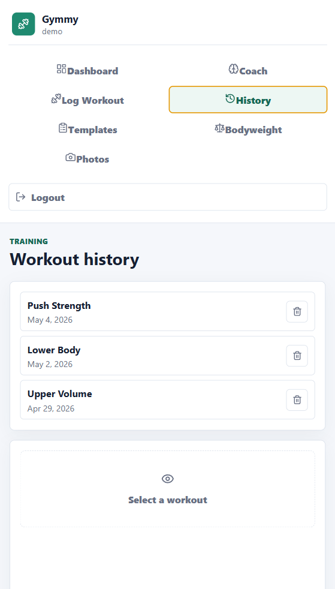
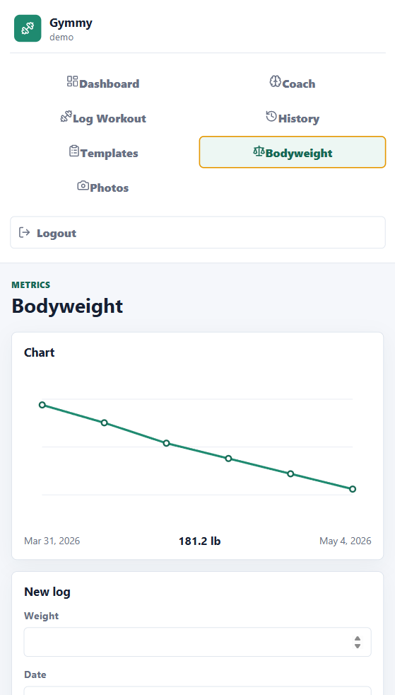

# Gymmy

Gymmy is a full-stack fitness tracking app for logging workouts, tracking bodyweight, storing progress photos, estimating PRs, and getting concise AI coaching answers from structured training data.

The backend MVP is built with FastAPI, SQLAlchemy, SQLite, Pydantic, JWT authentication, pytest, and the OpenAI API. The frontend MVP is built with Vite and React.

## Current Features

- User signup, login, logout, and JWT-protected app routes
- Workout logging with exercises and sets
- Workout history and workout detail views
- Estimated one-rep max lookup by exercise
- Reusable workout templates
- Bodyweight logging and charting
- Progress photo URL entries and real JPEG/PNG/WEBP uploads
- AI Coach tab for direct training answers
- Demo seed data for portfolio screenshots
- Backend API tests
- Docker and Docker Compose support

## Tech Stack

### Backend

- FastAPI
- SQLAlchemy
- SQLite
- Pydantic
- JWT authentication
- bcrypt password hashing
- OpenAI API
- pytest

### Frontend

- React
- Vite
- JavaScript
- CSS
- lucide-react icons

### Tooling

- Docker
- Docker Compose

## Architecture

```text
Browser
  |
  | React app, JWT stored locally
  v
FastAPI backend
  |
  | SQLAlchemy ORM
  v
SQLite database

FastAPI backend
  |
  | Structured training summary
  v
OpenAI Responses API
```

The frontend calls the backend with bearer-token authentication. The backend owns authentication, validation, persistence, PR calculations, upload handling, and AI coaching summary generation.

## Project Structure

```text
Gymmy/
  backend/
    main.py
    database.py
    models.py
    schemas.py
    auth.py
    seed_demo.py
    requirements.txt
    Dockerfile
    .env.example
    routes/
      users.py
      workouts.py
      templates.py
      bodyweight.py
      progress_photos.py
      coach.py
    tests/
      conftest.py
      test_auth.py
      test_coach.py
      test_health.py
      test_other_routes.py
      test_workouts.py
    uploads/
      progress_photos/
  frontend/
    index.html
    package.json
    vite.config.js
    Dockerfile
    nginx.conf
    .env.example
    src/
      App.jsx
      api.js
      main.jsx
      styles.css
  docs/
    screenshots/
  docker-compose.yml
  README.md
```

`backend/uploads/`, local databases, virtual environments, `node_modules/`, build output, and `.env` files are intentionally ignored by Git.

## Backend Setup

From the repo root, move into the backend folder:

```bash
cd backend
```

Create a virtual environment:

```bash
python -m venv venv
```

Activate the virtual environment.

Windows PowerShell:

```powershell
venv\Scripts\Activate.ps1
```

If PowerShell blocks activation, allow scripts for the current shell session:

```powershell
Set-ExecutionPolicy -Scope Process -ExecutionPolicy Bypass
venv\Scripts\Activate.ps1
```

Mac/Linux:

```bash
source venv/bin/activate
```

Install backend dependencies:

```bash
pip install -r requirements.txt
```

Create your local environment file:

```bash
cp .env.example .env
```

Windows PowerShell:

```powershell
Copy-Item .env.example .env
```

Then update `.env`:

```env
SECRET_KEY=replace-with-a-long-random-secret
DATABASE_URL=sqlite:///./gymmy.db
ACCESS_TOKEN_EXPIRE_MINUTES=10080
OPENAI_API_KEY=
OPENAI_MODEL=gpt-5-mini
```

`SECRET_KEY` signs JWT login tokens. `OPENAI_API_KEY` is only needed for live AI Coach responses.

## Run The API

Start the FastAPI development server from the `backend/` folder:

```bash
uvicorn main:app --reload
```

The API will run at:

```text
http://127.0.0.1:8000
```

Open Swagger docs:

```text
http://127.0.0.1:8000/docs
```

Health check:

```text
GET /health
```

Expected response:

```json
{
  "status": "ok",
  "app": "Gymmy API"
}
```

## Frontend Setup

From the repo root, move into the frontend folder:

```bash
cd frontend
```

Install frontend dependencies:

```bash
npm install
```

Create your local frontend environment file:

```bash
cp .env.example .env
```

Windows PowerShell:

```powershell
Copy-Item .env.example .env
```

Default frontend environment:

```env
VITE_API_URL=http://127.0.0.1:8000
```

Start the Vite development server:

```bash
npm run dev
```

The frontend will run at:

```text
http://127.0.0.1:5173
```

Build the frontend:

```bash
npm run build
```

## Demo Data

Seed a demo account from the `backend/` folder:

```bash
python seed_demo.py
```

Demo login:

```text
Username: demo
Password: password123
```

The seed script recreates only the demo user, then adds workouts, sets, templates, bodyweight logs, and a sample progress photo URL.

## Run Tests

From the `backend/` folder:

```bash
pytest
```

If `pytest` is not on your PATH, run it through the virtual environment:

```powershell
venv\Scripts\python.exe -m pytest
```

Current backend result:

```text
20 passed
```

Tests use `sqlite:///./test_gymmy.db` and reset the database between tests. AI Coach tests mock the OpenAI call so the test suite does not spend credits.

## Docker

Run the full app with Docker Compose from the repo root:

```bash
docker compose up --build
```

Frontend:

```text
http://localhost:5173
```

Backend:

```text
http://localhost:8000
```

Docker Compose uses named volumes for SQLite data and uploaded files:

- `gymmy_data`
- `gymmy_uploads`

Set these environment variables in your shell or a root-level `.env` file before running Compose if you want AI Coach enabled in Docker:

```env
SECRET_KEY=replace-with-a-long-random-secret
OPENAI_API_KEY=your-openai-key
OPENAI_MODEL=gpt-5-mini
```

## API Overview

### Auth And Users

| Method | Endpoint | Description |
| --- | --- | --- |
| `POST` | `/signup` | Create a user account |
| `POST` | `/login` | Log in and receive a bearer token |
| `GET` | `/me` | Get the current authenticated user |

### Workouts

| Method | Endpoint | Description |
| --- | --- | --- |
| `POST` | `/workouts/` | Create a workout with exercises and sets |
| `GET` | `/workouts/` | List the current user's workouts |
| `GET` | `/workouts/{workout_id}` | Get one workout |
| `DELETE` | `/workouts/{workout_id}` | Delete one workout |
| `GET` | `/workouts/prs/{exercise_name}` | Get the best estimated one-rep max for an exercise |

### Templates

| Method | Endpoint | Description |
| --- | --- | --- |
| `POST` | `/templates/` | Create a reusable workout template |
| `GET` | `/templates/` | List templates |
| `GET` | `/templates/{template_id}` | Get one template |
| `PUT` | `/templates/{template_id}` | Update one template |
| `DELETE` | `/templates/{template_id}` | Delete one template |

### Bodyweight

| Method | Endpoint | Description |
| --- | --- | --- |
| `POST` | `/bodyweight/` | Log bodyweight |
| `GET` | `/bodyweight/` | List bodyweight logs |
| `DELETE` | `/bodyweight/{log_id}` | Delete one bodyweight log |

### Progress Photos

| Method | Endpoint | Description |
| --- | --- | --- |
| `POST` | `/progress-photos/` | Create a URL-only progress photo entry |
| `POST` | `/progress-photos/upload` | Upload a JPEG, PNG, or WEBP progress photo |
| `GET` | `/progress-photos/` | List progress photos |
| `GET` | `/progress-photos/{photo_id}` | Get one progress photo |
| `DELETE` | `/progress-photos/{photo_id}` | Delete one progress photo row |
| `GET` | `/uploads/progress_photos/{filename}` | Serve an uploaded progress photo |

### Coach

| Method | Endpoint | Description |
| --- | --- | --- |
| `POST` | `/coach/` | Return one short AI coaching answer |

## AI Coach

Gymmy does not send raw database files to OpenAI. The backend builds a structured summary with:

- Recent workouts
- Exercise sets
- Best PR estimates
- Bodyweight trend
- Training frequency
- Simple recovery signals
- Progress-photo count and notes metadata

Coach answers personal questions with Gymmy data when relevant, and answers general lifting questions from training principles. Responses are intentionally short and direct.

Example:

```text
Question: What is my estimated PR based on Bench Press?
Answer: Your current best estimated 1RM is 210, based on 150 x 12. Treat that as a rough estimate because high-rep calculations are less precise.
```

## Screenshots

### Dashboard



### Workout History



### Bodyweight



## Deployment Notes

Recommended free testing setup:

- Frontend: Vercel or Netlify
- Backend: Render

Frontend settings:

- Root directory: `frontend`
- Build command: `npm run build`
- Output directory: `dist`
- Environment variable: `VITE_API_URL=https://your-backend-url`

Backend settings:

- Root directory: `backend`
- Build command: `pip install -r requirements.txt`
- Start command: `uvicorn main:app --host 0.0.0.0 --port $PORT`
- Environment variables:
  - `SECRET_KEY`
  - `DATABASE_URL`
  - `ACCESS_TOKEN_EXPIRE_MINUTES`
  - `OPENAI_API_KEY`
  - `OPENAI_MODEL`

For a public deployment, add the deployed frontend origin to the backend CORS allowlist in `backend/main.py`.

SQLite and local uploaded files are fine for local demos and early portfolio testing. For production, move to a hosted database and object storage, such as Postgres plus S3, Cloudinary, or Supabase Storage.

## Status

Gymmy is a working full-stack MVP with a tested FastAPI backend, React frontend, progress photo uploads, PR estimates, bodyweight tracking, templates, and AI Coach.

## Roadmap

- Add edit forms for workouts and bodyweight logs
- Add frontend test coverage
- Add production database support
- Move uploads to object storage
- Add screenshot assets
- Add hosted deployment
